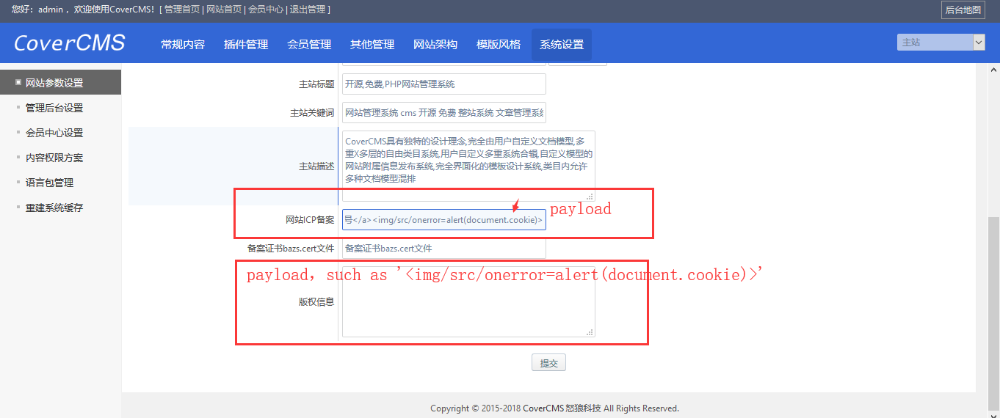
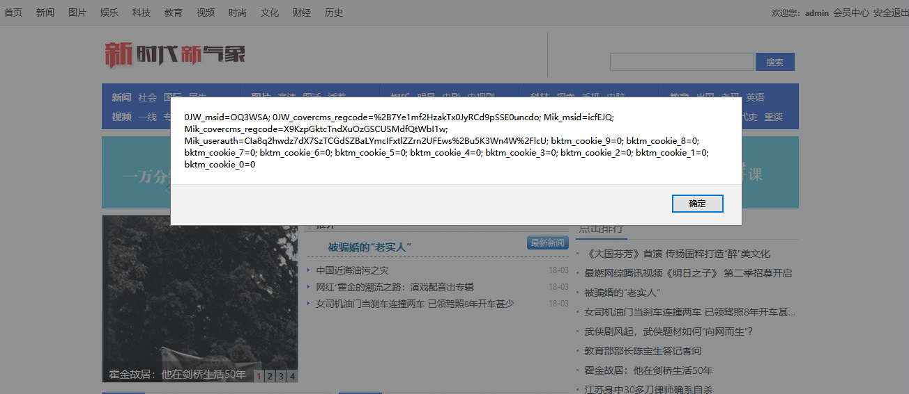
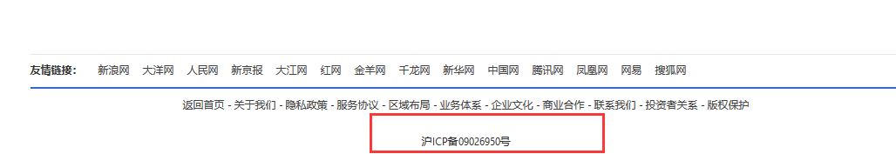

####1.Vulnerability type:
XSS
####2.Vulnerability program:
CoverCMS v1.1.6
####3.Download address:
http://down.admin5.com/php/140256.html
####4.The official website:

http://www.svipplus.com/
####5.Vulnerability description:
Some background input without filtering special characters, when the attacker receives the background power, you can enter these dangerous storage of some JavaScript script, and these dangerous field entry point in the corner at the front page (such as information site for the record, therefore) the attacker can obtain a permanent XSS shell, used to obtain real-time all users of the website cookie.

####6.POC:   ROOT_PATH/admina/mconfigs.inc.php  (12~72line)

if($action == 'cfsite'){
	url_nav(lang('webparam'),$urlsarr,'cfsite',12);
	if(!submitcheck('bmconfigs')){
		tabheader(lang('sitemessaadmi'),'cfsite',"?entry=mconfigs&action=cfsite$param_suffix",2,1);
		if(!$sid){
			trbasic(lang('hostname'),'mconfigsnew[hostname]',$mconfigs['hostname']);
			trbasic(lang('hosturl'),'mconfigsnew[hosturl]',$mconfigs['hosturl'],'text',lang('aghosturl'));
			trbasic(lang('cmsname'),'mconfigsnew[cmsname]',$mconfigs['cmsname']);
			trbasic(lang('cmsurl'),'mconfigsnew[cmsurl]',$mconfigs['cmsurl'],'text',lang('agcmsurl'));
			trspecial(lang('cmslogo'),'mconfigsnew[cmslogo]',$mconfigs['cmslogo'],'image');
			trbasic(lang('sitetitle'),'mconfigsnew[cmstitle]',$mconfigs['cmstitle'],'btext');
			trbasic(lang('sitekeyword'),'mconfigsnew[cmskeyword]',$mconfigs['cmskeyword'],'btext');
			trbasic(lang('sitedescrip'),'mconfigsnew[cmsdescription]',$mconfigs['cmsdescription'],'textarea');
			trbasic(lang('siteicpno'),'mconfigsnew[cms_icpno]',$mconfigs['cms_icpno'],'btext');
			trbasic(lang('bazscert'),'mconfigsnew[bazscert]',$mconfigs['bazscert'],'btext');
			trbasic(lang('copyrightmessage'),'mconfigsnew[copyright]',$mconfigs['copyright'],'textarea');
		}else{
			trbasic(lang('subsmallsite'),'subsitenew[smallsite]',$subsite['smallsite'],'text',lang('agcmsurl'));
			trspecial(lang('cmslogo'),'subsitenew[cmslogo]',$subsite['cmslogo'],'image');
			trbasic(lang('subsitetitle'),'subsitenew[cmstitle]',$subsite['cmstitle'],'btext');
			trbasic(lang('subkeyword'),'subsitenew[cmskeyword]',$subsite['cmskeyword'],'btext');
			trbasic(lang('subsitedescrip'),'subsitenew[cmsdescription]',$subsite['cmsdescription'],'textarea');
		}
		tabfooter('bmconfigs');
		a_guide('cfsite');
	}else{
		if(!$sid){
			if(empty($mconfigsnew['hosturl']) || !in_str('http://',$mconfigsnew['hosturl'])){
				amessage('hosturlillegal',M_REFERER);
			}
			$mconfigsnew['hosturl'] = strtolower($mconfigsnew['hosturl']);
			$mconfigsnew['cmsurl'] = empty($mconfigsnew['cmsurl']) ? '/' : trim(strtolower($mconfigsnew['cmsurl']));
			$mconfigsnew['cmsurl'] .= !ereg("/$",$mconfigsnew['cmsurl']) ? '/' : '';
			$c_upload = new cls_upload;	
			$mconfigsnew['cmslogo'] = upload_s($mconfigsnew['cmslogo'],$mconfigs['cmslogo'],'image');
			if($k = strpos($mconfigsnew['cmslogo'],'#')) $mconfigsnew['cmslogo'] = substr($mconfigsnew['cmslogo'],0,$k);
			saveconfig('site');
		}else{
			$subsitenew['smallsite'] = strtolower(trim($subsitenew['smallsite']));
			$subsitenew['smallsite'] .= !ereg("/$",$subsitenew['smallsite']) ? '/' : '';
			$subsitenew['smallsite'] = (!eregi("http://",$subsitenew['smallsite']) || eregi($hosturl,$subsitenew['smallsite'])) ? '' : $subsitenew['smallsite'];
			$c_upload = new cls_upload;	
			$subsitenew['cmslogo'] = upload_s($subsitenew['cmslogo'],$subsite['cmslogo'],'image');
			if($k = strpos($subsitenew['cmslogo'],'#')) $subsitenew['cmslogo'] = substr($subsitenew['cmslogo'],0,$k);
			$db->query("UPDATE {$tblprefix}subsites SET 
			smallsite='$subsitenew[smallsite]', 
			cmslogo='$subsitenew[cmslogo]',
			cmstitle='$subsitenew[cmstitle]',
			cmskeyword='$subsitenew[cmskeyword]',
			cmsdescription='$subsitenew[cmsdescription]' 
			WHERE sid='$sid'");
			updatecache('subsites');
		}
		$c_upload->closure(2, $sid, 'mconfigs');
		$c_upload->saveuptotal(1);
		unset($c_upload);
		adminlog(lang('websiteset'),lang('sitemessaadmi'));
		amessage('websitesetfinish',M_REFERER);
	}
}

####7.Loophole reappearance:
The location of the input is as follows:

The status of the website's front desk:

The output point of the website front desk (the output point of the malicious XSS script):

